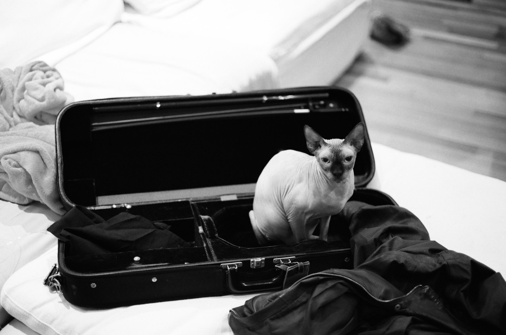
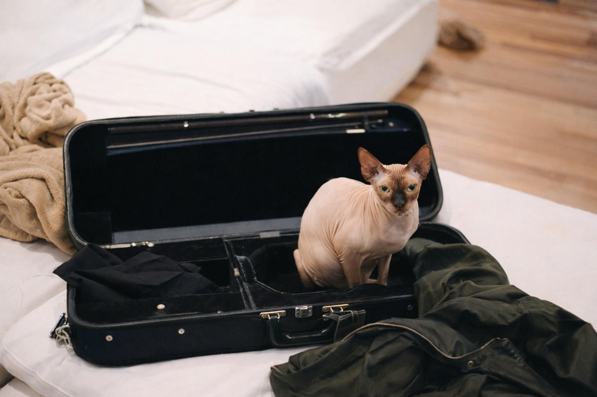
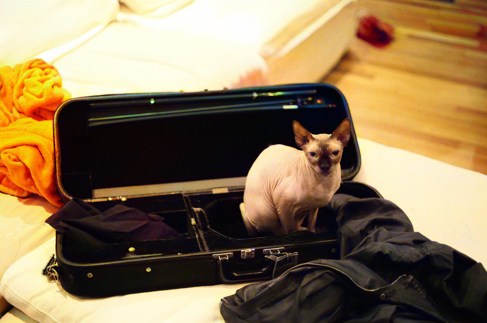
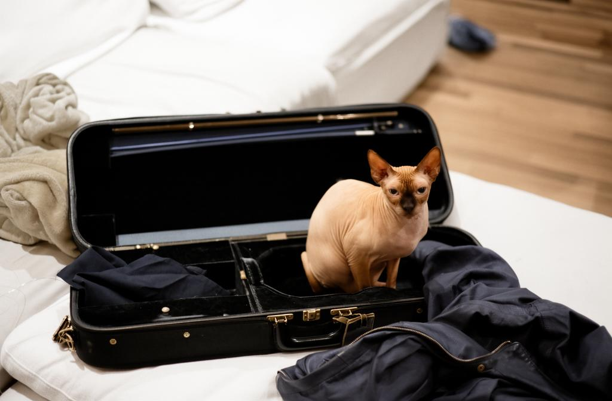

#+title: Image README

This is my cat. Oh, isn't he just so cute?

[[file:IMG_0956.JPEG]]

That is taken on my beloved Canon New F-1 with the FD 50mm f/1.8 lens and Portra 400. And how he's in greyscale using the ~skimage~ pipeline.

How did the models do? Well, ChatGPT did this.

DDColor did this (impressive job).

And Flux did not do very good at all.

So, takeaway? DDColor is best. But, that doesn't mean Flux isn't fun.
